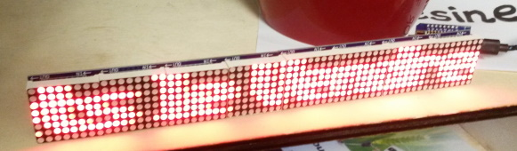

IcaLed
---------
Display an ICAL calendar from a WordPress plugins on a scrolling 8x8 Led Display  
This project is a fork of [labsud/icaLed](https://github.com/labsud/icaLed).  

# Bills of Materials

* **1** -- [Wemos D1 Mini](http://s.click.aliexpress.com/e/cPqHmPvI)
* **8** -- [LED display MAX7219 Dot Matrix Module](http://s.click.aliexpress.com/e/ce22ct6o)

# Boards used
* ESP8266 : https://arduino.esp8266.com/stable/package_esp8266com_index.json

# Libraries used
* MD_Parola
* MD_MAX72XX
* NTPClientLib
* ESPAsyncUDP : https://github.com/me-no-dev/ESPAsyncUDP
* TimeLib : https://github.com/PaulStoffregen/Time

# How to use it

All settings are located in **settings.h**

## WiFi

* ssid1 : WiFi Network
* ssid2 : Alternative WiFi Network
* url  : Calendar's URL (must be HTTPS)
* connectionInterval : Update each hour

## Matrix
* HARDWARE_TYPE : See https://github.com/MajicDesigns/MD_Parola
* MAX_DEVICES   : 8
* CLK_PIN       : D5
* DATA_PIN      : D6 
* CS_PIN        : D7
```

